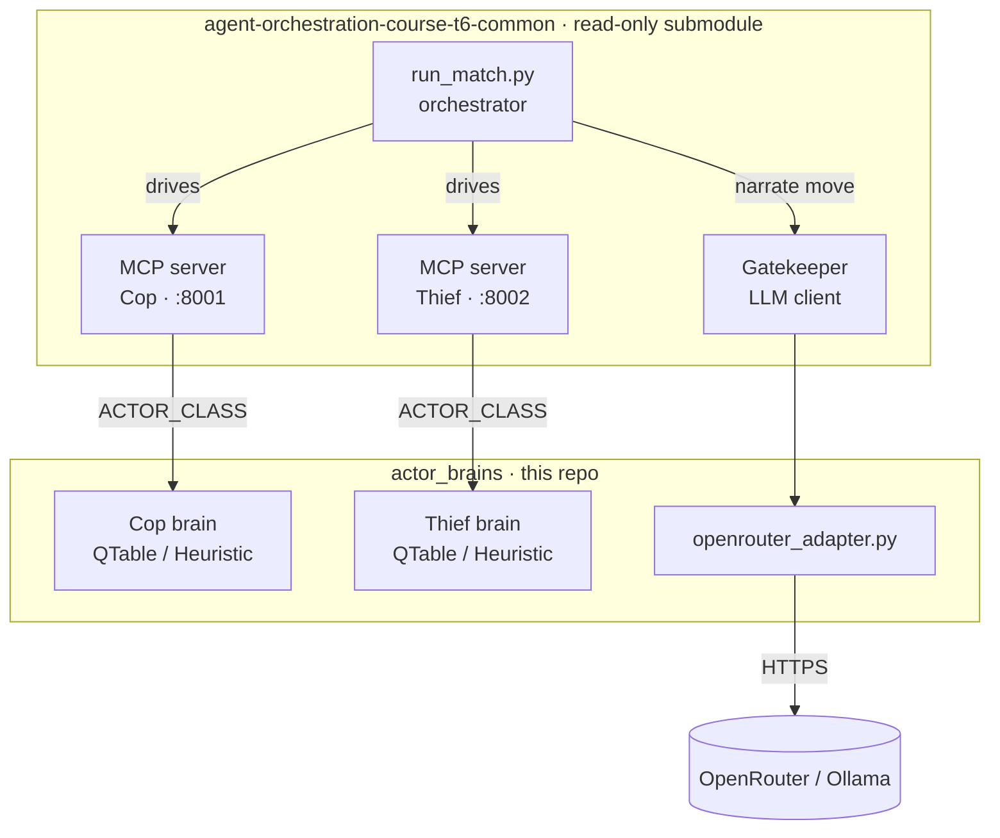
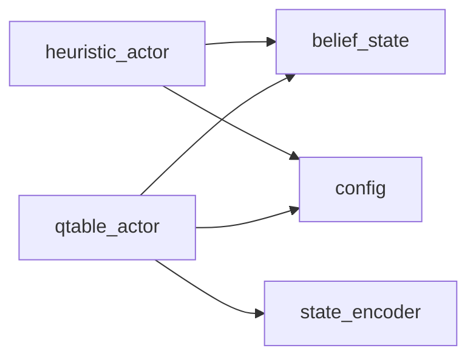
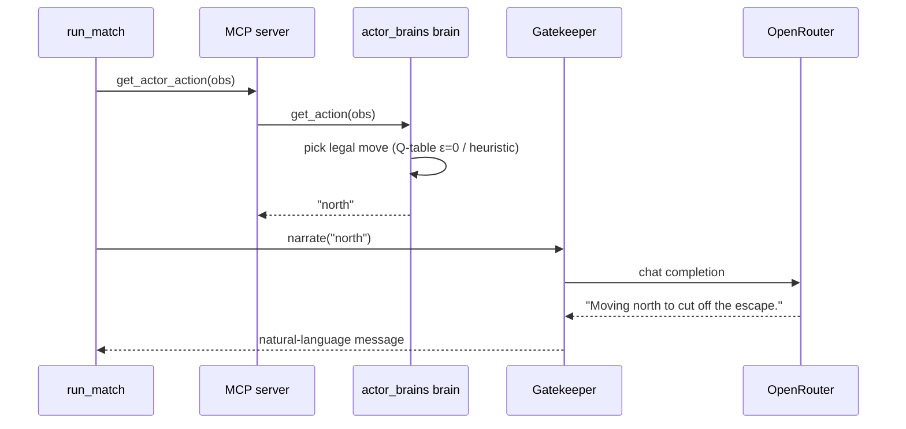
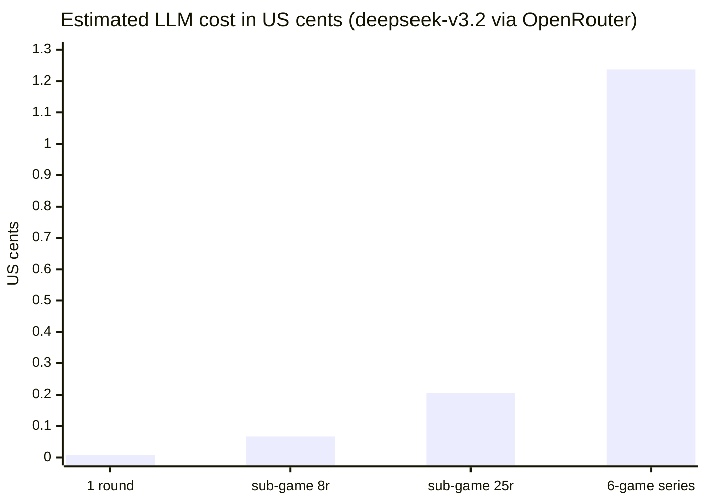

<h1 align="center">🕵️ AI-actor-game</h1>
<p align="center"><em>Decision "brains" for a Cop &amp; Thief pursuit-evasion game that talk over MCP.</em></p>

<p align="center">
  <a href="https://github.com/evya1/AI-actor-game/actions/workflows/ci.yml"></a>
  
  
  
  
  
  
  <a href="LICENSE"></a>
  
  
</p>

Team-specific **actor "brains"** for Exercise 6 of the AI Orchestration course
(University of Haifa). Two agents — a **Cop** and a **Thief** — play a
pursuit-evasion game on a 5×5 grid and talk over MCP. The game engine, MCP
servers, agent/parser, LLM integration, and match orchestrator are all provided
by the **read-only git submodule** `agent-orchestration-course-t6-common`.

| Doc | What's inside |
|-----|---------------|
| [`docs/PRD.md`](docs/PRD.md) | Requirements, KPIs, success criteria |
| [`docs/PLAN.md`](docs/PLAN.md) | Architecture, C4/UML, ADRs |
| [`docs/INTERFACES.md`](docs/INTERFACES.md) | Class contracts (BaseActor, etc.) |
| [`docs/LLM_BACKENDS.md`](docs/LLM_BACKENDS.md) | LLM setup for live matches |
| [`docs/QTABLE_RETRAINING_REPORT.md`](docs/QTABLE_RETRAINING_REPORT.md) | Fixed-seed before/after RL metrics |
| [`docs/AI_USAGE_AND_COST.md`](docs/AI_USAGE_AND_COST.md) | Full token/cost accounting (Claude + Codex + OpenRouter) |
| [`docs/EX06_ASSIGNMENT.md`](docs/EX06_ASSIGNMENT.md) | The original course brief |

---

## Contents

- [Overview](#overview--in-30-seconds)
- [What's in this repo](#whats-in-this-repo)
- [How a turn works](#how-a-turn-works)
- [Game & configuration](#game--configuration-at-a-glance)
- [Results](#results)
- [Cost](#cost)
- [Quick start](#quick-start)
- [LLM backends](#llm-backends-cosmetic-nl-message-only)
- [Your strategy stays private](#your-strategy-stays-private)
- [Status & roadmap](#status--roadmap)

---

## Overview — in 30 seconds

The submodule runs the **game and the servers**; we ship the **move logic**. Two
interchangeable brains implement one tiny contract (`get_action(obs) -> str`):

- **`HeuristicActor`** — rule-based scoring of legal moves (distance, edges, barriers, traps).
- **`QTableActor`** — tabular Q-learning, trained **offline**, played at ε=0.

At match time the submodule loads our class by dotted path via an environment
variable, runs the pursuit, and an LLM only **narrates** each chosen move in
natural language. Nothing about our strategy ever leaves this repo.



---

## What's in this repo

Five independent modules under `src/actor_brains/` (each ≤150 lines, single
responsibility, no actor imports another actor):

| Module | Responsibility |
|--------|----------------|
| `config.py` | Load `config/actor_config.json`, merge over defaults, validate schema |
| `belief_state.py` | Track opponent position estimate under partial observability |
| `heuristic_actor.py` (+ `heuristic_scoring.py`) | Rule-based Cop/Thief actor — scores legal moves (distance, edges, barriers, traps) |
| `state_encoder.py` | Map an observation to a compact Q-table index (relative encoding, ADR-002) |
| `qtable_actor.py` | Tabular Q-learning actor — ε-greedy, Bellman update, save/load |

Plus tooling in `scripts/` (not part of the package contract):

| Script | Purpose |
|--------|---------|
| `selfplay.py` | Drive the submodule `Game` engine directly (used by tests + trainer) |
| `train_qtable.py` | **Offline** Q-learning trainer → writes `models/{cop,thief}_qtable.npy` |
| `openrouter_adapter.py` | Ollama-compatible shim → OpenRouter (see LLM backends below) |
| `run_stack.py` | One-command full-stack launcher (`local` / `cross-team`) |

Module dependency graph (enforced — no cross-actor imports):



<!-- BEGIN GENERATED: repo-facts -->
_Facts below are generated by `scripts/readme_sync.py` — do not edit._

**Tests:** n/a

**Modules (150-line rule):**

| Module | Lines |
|--------|-------|
| `actor_brains/__init__.py` | 14 |
| `actor_brains/belief_state.py` | 62 |
| `actor_brains/config.py` | 114 |
| `actor_brains/heuristic_actor.py` | 126 |
| `actor_brains/heuristic_scoring.py` | 131 |
| `actor_brains/qtable_actor.py` | 150 |
| `actor_brains/shared/__init__.py` | 1 |
| `actor_brains/shared/version.py` | 9 |
| `actor_brains/state_encoder.py` | 81 |

**Trained models:**
- `models/cop_qtable.npy`: 52,048 bytes
- `models/thief_qtable.npy`: 52,048 bytes
<!-- END GENERATED: repo-facts -->

---

## How a turn works

The submodule's server imports our class at runtime via **environment variables**
— no code changes to the submodule, ever:

```
ACTOR_CLASS=actor_brains.qtable_actor.QTableActor   # dotted path to a BaseActor subclass
ACTOR_TABLE=models/cop_qtable.npy               # optional → triggers .load(role, path)
```

`run_match.py --mode actor` injects `ACTOR_CLASS`, `ACTOR_TABLE`, and
`PYTHONPATH=../src` into both server subprocesses automatically. Our actors
subclass `BaseActor` (`get_action(obs) -> str`, `on_result(...)`), accept an
optional `role` kwarg, and `load()` tolerates a missing table (cold start).



> **Two facts to internalize before extending the RL side:**
> 1. **Q-learning trains offline.** The submodule match path loads a *fresh* actor
>    every turn and **never calls `on_result`**, so online learning mid-match is
>    impossible. We train offline with `scripts/train_qtable.py` and load the static
>    table at **ε=0** (pure exploitation).
> 2. **The 5×5 game is cop-dominant.** With equal king-move speed and full visibility
>    a competent pursuer always captures, so *any* thief wins ~0% as cop-chaser. We
>    report honest, fixed-seed results rather than inflated ones.

---

## Game &amp; configuration at a glance

Everything below lives in `config/actor_config.json` — **zero hardcoding** (assignment §10):

| Group | Setting | Value |
|-------|---------|-------|
| Game | grid · `max_moves` · sub-games · `max_barriers` | 5×5 · 25 · 6 · 5 |
| Heuristic | distance / barrier / edge weights · trap penalty | 3.0 · 2.0 · 1.5 · 4.0 |
| RL | learning rate · discount · ε start→min · decay | 0.1 · 0.9 · 1.0→0.05 · 0.995 |
| RL rewards | win · lose · step cost | +10 · −10 · −0.1 |

---

## Results

Deterministic fixed-seed evaluation (seeds `1000..1049`, 50 games each) from
[`docs/QTABLE_RETRAINING_REPORT.md`](docs/QTABLE_RETRAINING_REPORT.md), old vs
retrained Q-table:

| Role under evaluation | Old wins / 50 | New wins / 50 | Read |
|-----------------------|:-------------:|:-------------:|------|
| Cop vs heuristic thief | 8 | 9 | ≈ unchanged — the game is cop-dominant |
| Thief vs heuristic cop | 25 | **45** | materially better survival after the RL fixes |

Series-level sub-game win rate with alternating roles = **50%**, meeting the KPI.

```mermaid
xychart-beta
    title "Wins out of 50 fixed-seed games — old (left) vs new (right)"
    x-axis ["Cop vs heuristic thief", "Thief vs heuristic cop"]
    y-axis "Wins / 50" 0 --> 50
    bar [8, 25]
    bar [9, 45]
```



---

## Cost

The actors are free to run; the only metered spend is the **LLM narration** during
live matches. Measured on **OpenRouter** with `deepseek/deepseek-v3.2` (199 billed
calls, **$0.0082** total, blended **~$0.0000413 / call**). Each round = 2 LLM calls
(one thief + one cop):

| Unit | LLM calls | Estimated cost |
|------|:---------:|:--------------:|
| 1 round | 2 | $0.00008 |
| 1 sub-game (8 rounds, smoke cap) | 16 | $0.00066 |
| 1 sub-game (25 moves, official cap) | 50 | $0.00206 |
| **Full 6-sub-game series** | 96–300 | **$0.004 – $0.012 (≈ 1–1.5¢)** |



OpenRouter routes across ~11 providers at ~5× price spread (Baidu ~$0.000019 →
Google ~$0.000098 per call); the figures above are the blended rate actually paid.

**Why it's this cheap:** the actor decides every move deterministically (Q-table
at ε=0, or the heuristic) — the LLM is called only to *narrate* the chosen move,
so completions are ~15–20 tokens. Swap in a local Ollama model and the per-match
cost drops to **$0**. At scale a full official series is ~1.2¢, so **1,000
series ≈ $12** of narration.

**Cost by backend** — a full 6-sub-game series (25-move cap ≈ 300 narration calls,
~120 in / ~18 out each):

| Backend / model | Rate (in / out per 1M) | Est. cost / series |
|---|---|---:|
| Ollama (local `llama3.2`) | free | **$0** |
| OpenRouter `deepseek/deepseek-v3.2` | metered, blended | **~$0.012** (measured) |
| Anthropic `claude-haiku-4-5` | $1 / $5 | ~$0.06 (list-price est.) |
| Anthropic `claude-opus-4-8` | $5 / $25 | ~$0.32 (list-price est.) |

Anthropic figures are illustrative list-price estimates, not measured. Since the
actor — not the LLM — makes every decision, model choice affects only narration
style and price, never play quality.

**CI cost: $0.** The GitHub Actions workflow runs only keyless quality gates
(ruff, line-cap, validators, secret/doc/link checks) and the test suite — no
metered model calls. The one gated pytest job needs a read-only submodule deploy
key, not a paid API key, so continuous integration never incurs LLM spend.

**Development-cost transparency.** This repo was built with AI assistance
(Claude Code + Codex). The **only real metered spend on the whole project was
$0.0082** (the OpenRouter smoke above) — every coding/agent session ran under a
flat subscription/plan with no per-token charge. The complete, transcript-verified
token accounting across all engines (Claude, Codex, OpenRouter), plus an
illustrative "if it had been API-metered" estimate, lives in
[`docs/AI_USAGE_AND_COST.md`](docs/AI_USAGE_AND_COST.md).

---

## Quick start

```bash
uv sync                                   # install deps (numpy, pytest, ruff)
uv run pytest --cov=actor_brains              # 114 tests, 99% coverage on our modules
uv run ruff check src tests scripts       # 0 violations
uv run python scripts/train_qtable.py     # train → models/{cop,thief}_qtable.npy
```

Run a full match (needs an LLM for the cosmetic NL message — see
[`docs/LLM_BACKENDS.md`](docs/LLM_BACKENDS.md)). From inside the submodule:

```bash
cd agent-orchestration-course-t6-common
uv run python scripts/run_match.py --mode actor \
    --actor-class actor_brains.qtable_actor.QTableActor \
    --models-dir ../models --seed 42
```

Swap `--actor-class actor_brains.heuristic_actor.HeuristicActor` for the rule-based
baseline (no training needed).

---

## LLM backends (cosmetic NL message only)

The actor decides the move; the LLM only narrates it ("Moving north…"). Any free
model suffices. Pick **one** backend — full setup in
[`docs/LLM_BACKENDS.md`](docs/LLM_BACKENDS.md):

| Backend | Cost | Setup |
|---------|------|-------|
| **Ollama** (local / VPS) | free | `OLLAMA_BASE_URL`, `LLM_MODEL=llama3.2` — natively supported |
| **OpenRouter** (cloud, free tier) | free/cheap | run `scripts/openrouter_adapter.py`, set `OLLAMA_BASE_URL` to it + `OPENROUTER_API_KEY` |
| **Anthropic** (cloud) | paid | `ANTHROPIC_API_KEY` — natively supported |

Copy `.env.example` → `.env` and fill in your chosen backend.

> **Note:** the MCP server itself never calls the LLM — the Gatekeeper lives in
> the orchestrator/client. Use the one-command launcher to run the full stack:
>
> ```bash
> uv run python scripts/run_stack.py local --mode actor --seed 42          # self-play
> uv run python scripts/run_stack.py cross-team --opponent-url <URL> \      # vs partner
>     --my-role thief --game-id m42_sg01 --seed 42 --port 8080
> ```
>
> It auto-detects the backend and boots the OpenRouter adapter when needed.

### Sample run (verified local end-to-end smoke)

OpenRouter backend, model `deepseek/deepseek-v3.2`, seed 42 (exit 0; adapter +
both MCP servers start, health checks pass, actor sub-games complete, children
shut down cleanly). The Q-table actor picks each move; the LLM only narrates it:

```text
[match] seed=42 series_id=series0042 mode=actor game_type=internal
[match] server(s) up — opponent: http://localhost:8002
[sub-game 1/6  attempt 1]  a=thief b=cop
[round 1]
[gatekeeper] model=deepseek/deepseek-v3.2 in=94 out=19
  thief says: "Continuing east to put distance between me and the cop while scanning for future escape routes."
[gatekeeper] model=deepseek/deepseek-v3.2 in=126 out=15
  cop says: "Moving southeast to close ground and anticipate your movement toward the eastern edge."
[round 2]
  thief says: "Slipping south to evade the pursuit closing in from the northeast and buy time."
  cop says: "Moving northeast to intercept and trap the thief’s southern retreat."
  ... (rounds 3–8) ...
  winner=None (thief_survived)
[sub-game 2/6  attempt 1]  a=cop b=thief
  ...
  winner=None (thief_survived)
[series] totals: cop=10  thief=20
[run_stack] adapter stopped
```

> Reproduce with:
> `uv run python scripts/run_stack.py --backend openrouter local --mode actor --seed 42 --max-rounds 8 --num-games 2`
> (needs `OPENROUTER_API_KEY` + `LLM_MODEL` exported; never commit keys). This is
> a local integration smoke, **not** the official six-game session.

---

## Your strategy stays private

Our code lives **only in this repo** and is loaded into the submodule's process
at runtime via `PYTHONPATH` — it is never copied into the submodule (a separate,
read-only repo). In a real cross-team match each team runs its own server; the
servers exchange only **actions and NL messages** over MCP, never code or
Q-tables. Keep it that way: never place our files inside
`agent-orchestration-course-t6-common/`, and keep this repo private to the team.

---

## Status &amp; roadmap

**Done:** Phases 0–3 (config, heuristic, RL + offline trainer, integration) —
99% coverage / ruff-clean / all files ≤150 lines; OpenRouter adapter; full-stack
launcher (`run_stack.py`) with local + cross-team modes; Phase 6 quality-gate &amp;
CI infrastructure (11-hook pre-commit suite, keyless CI workflow — `docs/PLAN.md` §8);
verified local end-to-end smoke.

**Next:** survival-time reward shaping for broader opponent mixes; learning-curve
notebook; official cross-team six-game session; enable CI's gated pytest job via
the `SUBMODULE_SSH_KEY` repo secret (`docs/TODO.md` 6.4).

---

<p align="center">
  <sub><code>actor_brains</code> v1.01 · MIT License · AI Orchestration (Ex. 6), University of Haifa · engine &amp; servers by <code>agent-orchestration-course-t6-common</code></sub>
</p>
