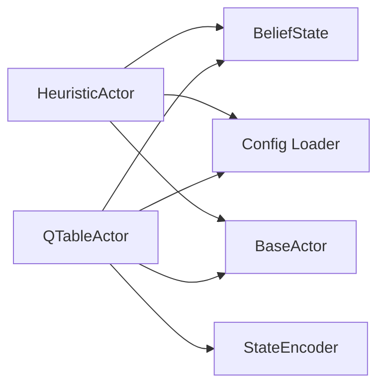

# Class Interfaces — Cop & Thief Actors

## Version 1.0 | 2026-06-25

> Derived from [PLAN §5 API Documentation](PLAN.md#5-api-documentation) and [PRD §3.1 Submodule Interface](PRD.md#31-the-submodule-interface-read-only-contract).

---

## 1. Submodule Contract (Read-Only)

These types are provided by `agent-orchestration-course-t6-common`. **Do not modify.**

### BaseActor

```python
class BaseActor(ABC):
    @abstractmethod
    def get_action(self, obs: ObservationState) -> str:
        """Return one legal action from obs.legal_moves."""

    def on_result(self, obs: ObservationState, action: str, result: ActionResult) -> None:
        """Feedback after the action resolves (for learning agents)."""
```

### ObservationState

| Field | Type | Description |
|-------|------|-------------|
| `actor` | `str` | `"cop"` or `"thief"` |
| `round` | `int` | Current round number |
| `my_pos` | `tuple[int, int]` | My position `(col, row)` |
| `opponent_pos` | `tuple[int, int] \| None` | Opponent position (None if out of view radius) |
| `barriers` | `list[tuple[int, int]]` | Active barrier positions |
| `legal_moves` | `list[str]` | Valid actions — **always return one of these** |
| `barriers_remaining` | `int \| None` | Barriers left for Cop (`None` for Thief) |

### ActionResult

| Field | Type | Description |
|-------|------|-------------|
| `success` | `bool` | Action succeeded |
| `error` | `str \| None` | Error message if failed |
| `game_over` | `bool` | Sub-game ended |
| `winner` | `str \| None` | `"cop"` or `"thief"` |
| `win_reason` | `str \| None` | `"capture"`, `"thief_survived"`, `"thief_trapped"`, `"cop_trapped"` |

### Action Space

| Action | Description | Available To |
|--------|-------------|--------------|
| `N`, `NE`, `E`, `SE`, `S`, `SW`, `W`, `NW` | Move one cell | Both |
| `BARRIER` | Place barrier on current cell | Cop only (max 5) |

---

## 2. Our Implementations

### 2.1 HeuristicActor

**File:** `src/actor_t6/heuristic_actor.py`  
**Phase:** 1 (Heuristic Baseline)  
**Extends:** `BaseActor`

```python
class HeuristicActor(BaseActor):
    """Rule-based actor for Cop and Thief roles."""

    def __init__(
        self,
        role: str | None = None,
        weights: dict | None = None,
        grid_size: tuple[int, int] = DEFAULT_GRID_SIZE,
    ) -> None:
        """Create with optional role, heuristic weight, and grid overrides.

        `role` is accepted so the submodule loader's preferred
        `actor_cls(role=role)` path works (FR-01.5); when None the role is
        detected from `obs.actor` at runtime. `grid_size` reuses the submodule's
        physical constant and is used only for edge/trap scoring."""

    def get_action(self, obs: ObservationState) -> str:
        """Return highest-scoring legal move.
        Returns: Action string from obs.legal_moves."""

    def on_result(self, obs: ObservationState, action: str, result: ActionResult) -> None:
        """Update belief state and statistics."""

    def save(self, path: Path) -> None:
        """Save belief state snapshot (optional)."""

    @classmethod
    def load(cls, role: str, path: Path, **kwargs) -> "HeuristicActor":
        """Load with optional weight overrides from kwargs."""
```

### 2.2 QTableActor

**File:** `src/actor_t6/qtable_actor.py`  
**Phase:** 2 (RL Backend)  
**Extends:** `BaseActor`

```python
class QTableActor(BaseActor):
    """Q-learning actor with tabular policy."""

    def __init__(
        self,
        role: str | None = None,
        grid_size: tuple[int, int] = DEFAULT_GRID_SIZE,
        **overrides: float,  # any rl config key: learning_rate, discount_factor,
                             # epsilon_start, epsilon_decay, epsilon_min,
                             # win_reward, lose_reward, step_cost
    ) -> None:
        """Create with RL hyperparameters (config defaults, override per-key)."""

    def get_action(self, obs: ObservationState) -> str:
        """Epsilon-greedy action selection; flushes the pending Bellman update.
        Returns: Action string from obs.legal_moves."""

    def on_result(self, obs: ObservationState, action: str, result: ActionResult) -> None:
        """Record reward; apply the terminal Bellman update + epsilon decay.

        NOTE: the submodule match path never calls this (a fresh actor is loaded
        each turn), so learning happens offline in scripts/train_qtable.py."""

    def save(self, path: Path) -> None:
        """Persist Q-table as .npy file."""

    @classmethod
    def load(cls, role: str, path: Path, **kwargs) -> "QTableActor":
        """Load Q-table from .npy. Sets epsilon=0 (pure exploitation)."""
```

### 2.3 StateEncoder

**File:** `src/actor_t6/state_encoder.py`  
**Phase:** 2 (RL Backend)  
**Type:** Utility (static methods)

```python
class StateEncoder:
    """Maps ObservationState to Q-table row index."""

    @staticmethod
    def encode(obs: ObservationState, grid_size: tuple[int, int]) -> int:
        """Encode relative position + edge proximity + barrier count.
        Returns: Integer state index [0, num_states)."""

    @staticmethod
    def num_states(grid_size: tuple[int, int]) -> int:
        """Return total number of distinct states."""
```

### 2.4 BeliefState

**File:** `src/actor_t6/belief_state.py`  
**Phase:** 1 (Heuristic Baseline)  
**Type:** Utility (shared by both actors)

```python
class BeliefState:
    """Tracks estimated opponent position under partial observability.

    A new sub-game is detected by canonical round regression, not by round 1.
    """

    def update(self, obs: ObservationState) -> None:
        """Incorporate new observation. Sets estimate from opponent_pos if known."""

    def get_estimate(self) -> tuple[int, int] | None:
        """Return current best estimate of opponent position."""

    def reset(self) -> None:
        """Clear estimate for new sub-game."""
```

### 2.5 Config Loader

**File:** `src/actor_t6/config.py`  
**Phase:** 0 (Project Setup)  
**Type:** Module-level functions

```python
def load_config(path: Path = DEFAULT_CONFIG_PATH) -> dict:
    """Load actor_config.json, validate schema, return merged defaults."""

def validate_schema(config: dict) -> None:
    """Raise ValueError on invalid types or missing required keys."""
```

---

## 3. Dependency Graph



- No module imports another actor module
- `heuristic_actor` and `qtable_actor` never import each other
- `belief_state` and `state_encoder` are leaf utilities with no internal dependencies

---

## 4. Launcher Tooling (client-side, not part of the actor package)

These live in `scripts/` and orchestrate the LLM stack. They consume the
submodule's **existing, unchanged** tools (no contract changes). The MCP server
never calls the LLM — the Gatekeeper lives here, in the client.

| Module | Responsibility | Env |
|--------|----------------|-----|
| `scripts/launch_common.py` | Stdlib helpers: `.env`/config parsing, `select_backend`, adapter lifecycle (`start_adapter`/`stop_process`), `wait_for_port`, `submodule_cmd` | main repo |
| `scripts/run_stack.py` | CLI launcher: `local` (adapter → `run_match.py`) and `cross-team` (adapter → own server → `run_peer_match.py`) | main repo |
| `scripts/run_peer_match.py` | Cross-team half-orchestrator: drives only the local side (`get_actor_action` → Gatekeeper NL → `take_action`), waits for the opponent | submodule |
| `scripts/peer_sync.py` | Pure turn-sync helpers: `state_fingerprint`, `read_terminal`, `wait_for_opponent` (injectable, unit-tested) | main repo |

Launcher constants are in `config/actor_config.json` under `launcher`.

---

*Document Version: 1.1*
*Last Updated: 2026-06-26*
