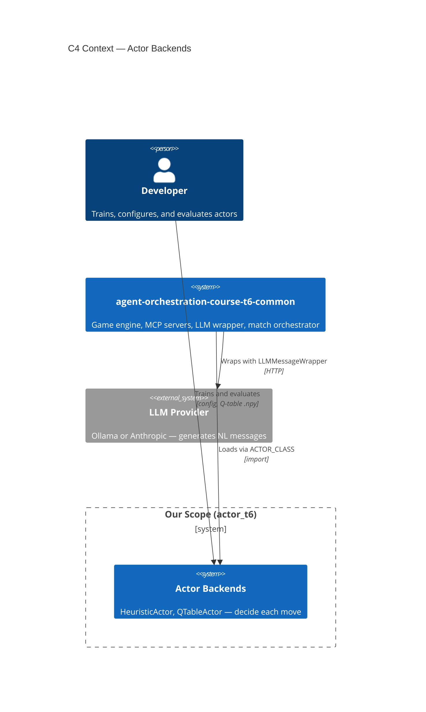
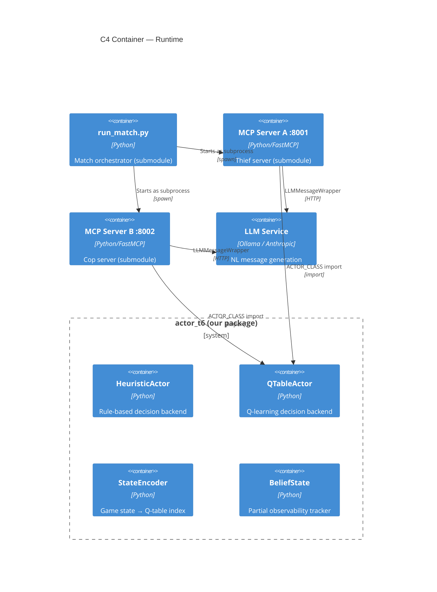
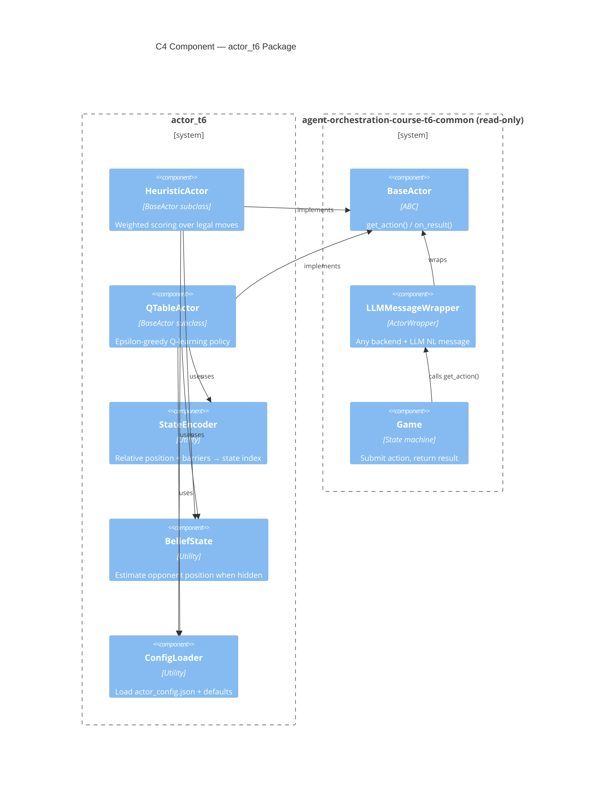
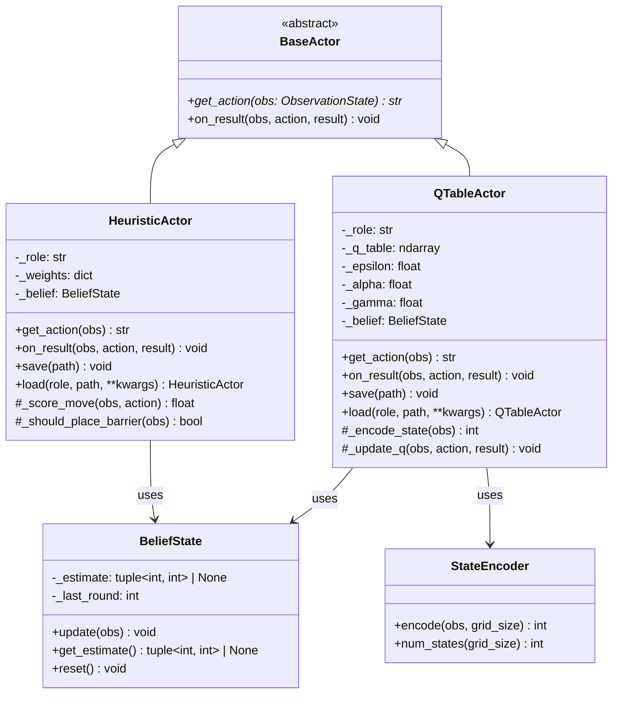

# Architecture & Planning — Cop & Thief Actors

## Version 1.1 | 2026-07-03

> **Change from v1.0:** Added §8 Quality Gates & CI Tooling.
>
> **Change from v1.1:** Added correctness remediation notes for RL updates,
> belief lifecycle, peer protocol alignment, and launcher process ownership.

---

## 1. C4 Model

### 1.1 Context Diagram



### 1.2 Container Diagram



### 1.3 Component Diagram



### 1.4 Code-Level Class Diagram



---

## 2. Program Architecture

### 2.1 Strategy Pattern (GoF, Gamma et al. 1995)

The actor backends implement the **Strategy Pattern** from the Gang of Four Design Patterns. This is the defining architectural choice for the entire project. All backends conform to the requirements in [PRD §3 Functional Requirements](PRD.md#3-functional-requirements).

> *Define a family of algorithms, encapsulate each one, and make them interchangeable. Strategy lets the algorithm vary independently from clients that use it.*
> — Gamma, Helm, Johnson, Vlissides, *Design Patterns: Elements of Reusable Object-Oriented Software*, 1995

**Mapping to our system:**

| Strategy Pattern Role | Our Implementation | What It Does |
|-----------------------|-------------------|--------------|
| **Strategy interface** | `BaseActor` (ABC, submodule) | Defines `get_action()` / `on_result()` contract |
| **Concrete strategies** | `HeuristicActor`, `QTableActor` | Interchangeable algorithms — swapped at runtime via `ACTOR_CLASS` |
| **Context (client)** | `ActorWrapper` / `LLMMessageWrapper` (submodule) | Calls `get_action()` without knowing which strategy is loaded |
| **Strategy factory** | `ACTOR_CLASS` env var + `importlib` (submodule) | Discovers and instantiates our actor at runtime — zero compile-time coupling |

The key property is what GoF calls **"algorithms vary independently of the clients that use them."** The submodule's `ActorWrapper` is the client — it calls `get_action()` on whatever `BaseActor` subclass is loaded. We can swap `HeuristicActor` → `QTableActor` → anything else without touching a single line of submodule code.

**Secondary patterns present:**

| Pattern | Where | Why |
|---------|-------|-----|
| **Decorator** | `LLMMessageWrapper` wraps any `BaseActor` | Adds NL message generation without modifying the backend |
| **Composition over Inheritance** | `BeliefState`, `StateEncoder` as composed utilities | Shared behavior injected as components, not mixed into the class hierarchy |
| **Plugin Architecture** | `ACTOR_CLASS` runtime import | Submodule loads our actor dynamically — no dependency in the opposite direction |

### ADR-001: Single Actor Class for Both Roles

**Status:** Accepted
**Date:** 2026-06-25

**Context:** The Cop and Thief share the same `BaseActor` interface. The submodule's `run_match.py` loads one `ACTOR_CLASS` for both servers, passing `role="cop"` or `role="thief"` to `load()`.

**Decision:** Implement a single actor class per backend (e.g. `HeuristicActor`) that detects its role from `obs.actor` at runtime. Role-specific logic is behind conditional branches or strategy delegates.

**Consequences:**
- **Pro:** One class to maintain, matches submodule's `ACTOR_CLASS` convention
- **Pro:** `run_match.py` loads the same class for both servers
- **Con:** Conditional logic inside `get_action()` — mitigated by extracting `_cop_strategy()` / `_thief_strategy()` methods
- **Alt considered:** Separate `CopActor` and `ThiefActor` classes — rejected because the submodule expects a single `ACTOR_CLASS`

### ADR-002: Relative Position Encoding for Q-Table

**Status:** Accepted
**Date:** 2026-06-25

**Context:** A 5×5 grid has 25 cells. Absolute positions for both agents yield 25 × 25 = 625 position combinations, plus barrier configurations. This creates an unwieldy Q-table.

**Decision:** Encode state using the **relative offset** between the actor and opponent (`dx, dy`), which yields at most 9 × 9 = 81 relative positions. Barriers encoded as a simplified proximity metric (count of barriers within 2 cells).

**Consequences:**
- **Pro:** Q-table size reduced from ~625+ to ~81 × 9 actions = ~729 entries
- **Pro:** Translational invariance — the actor learns position-agnostic policies
- **Con:** Loses absolute position context (e.g. corner vs center) — mitigated by including a "near_edge" flag in the state encoding
- **Alt considered:** Full absolute encoding — rejected for state space explosion

### ADR-003: Belief State as Shared Utility

**Status:** Accepted  
**Date:** 2026-06-25

**Context:** Both HeuristicActor and QTableActor need to handle `opponent_pos == None`. Duplicating belief-state logic violates DRY.

**Decision:** Extract `BeliefState` as a standalone utility class that both actors compose. It maintains a point estimate of the opponent's position and updates when `opponent_pos` becomes known.

**Consequences:**
- **Pro:** Single source of truth for partial observability logic
- **Pro:** Testable independently
- **Con:** Adds an indirection layer — acceptable given the shared need
- **Alt considered:** Mixin class — rejected because composition is cleaner and more testable

**Remediation update (2026-07-03):** The pinned engine initializes a sub-game at
round `0` and increments rounds normally, so `BeliefState` resets on observed
round regression rather than on `round <= 1`. This preserves a round-0 sighting
through normal round-1 progression while still clearing stale estimates on a new
sub-game or explicit `reset()`.

### ADR-006: Correct Learning Targets and Terminal Feedback

**Status:** Accepted  
**Date:** 2026-07-03

Self-play tracks each actor's latest unresolved transition. Non-terminal
feedback still goes only to the mover, but a terminal result is delivered once
to every actor with an unresolved action. Q-learning Bellman targets now compute
`max Q(s', a')` only over the next observation's `legal_moves`; illegal
role-specific or blocked actions never influence the target.

### ADR-007: Canonical Peer Protocol and Launcher Ownership

**Status:** Accepted  
**Date:** 2026-07-03

Cross-team orchestration derives `grid_size`, `view_radius`, `max_moves`,
timeouts, and forfeit tolerance from the pinned submodule configuration and
uses its proposal compatibility helper. Environment loading precedes
environment-sensitive imports. Launcher helpers own the processes they spawn:
child configuration is explicit, readiness failure cleans up the child, and
subprocess exit status is returned through `main()`.

### ADR-004: Config via JSON + Environment Variables

**Status:** Accepted  
**Date:** 2026-06-25

**Context:** The submodule uses `config/setup.json` for game parameters and `.env` for secrets. Our actors need their own hyperparameters.

**Decision:** Actor-specific config lives in `config/actor_config.json`. Secrets (API keys) remain in `.env`. The submodule's `config/setup.json` is read-only and used for game parameters.

**Consequences:**
- **Pro:** Clean separation — game config (submodule) vs actor config (ours)
- **Pro:** `.env` already handled by submodule's infrastructure
- **Con:** Two config files to manage — mitigated by clear naming convention
- **Alt considered:** All config in environment variables — rejected for readability and version control

---

## 3. Independent Modules

Each module has a single responsibility and can be unit-tested in isolation. See [PRD §3.2 FR-01](PRD.md#32-fr-01-actor-base-cop--thief) for shared requirements and [PRD §4.3 NFR](PRD.md#43-code-quality) for code quality constraints.

| Module | Responsibility | Unit Test Strategy |
|--------|---------------|-------------------|
| `config.py` | Load `actor_config.json`, validate schema, return defaults | Test with invalid/missing keys, verify defaults |
| `belief_state.py` | Track opponent position estimate, reset on new sub-game | Feed synthetic `ObservationState`, assert estimate updates |
| `state_encoder.py` | Map observation → Q-table index, reversible | Encode all grid positions, verify uniqueness and bounds |
| `heuristic_actor.py` | Score legal moves, return best, handle Cop/Thief roles | Mock observation, verify returned action ∈ `legal_moves` |
| `qtable_actor.py` | Epsilon-greedy selection, Bellman update, save/load | Feed action → result pairs, verify Q-values change correctly |

**Dependency graph (no cycles):**

```
heuristic_actor ──→ belief_state ──→ (nothing)
                    config
qtable_actor  ──→ state_encoder  ──→ (nothing)
            ──→ belief_state
            ──→ config
```

No module imports another actor module. `qtable_actor` imports `state_encoder` and `belief_state` (utilities), but `heuristic_actor` and `qtable_actor` never import each other.

---

## 4. Integration Testing Steps

Five steps, each verified before moving to the next. Each step uses the submodule's `run_match.py` with a specific grid size and backend. Maps to [TODO Phase 3](TODO.md#phase-3-integration--validation) integration tasks.

### Step 1 — Config + Factory (no game)

**Goal:** Verify our actor class is importable and instantiable.

```bash
cd agent-orchestration-course-t6-common
PYTHONPATH=../src uv run python -c "
from actor_t6.heuristic_actor import HeuristicActor
a = HeuristicActor()
print('OK:', a)
"
```

**Pass criterion:** No import errors, actor constructs with config loaded.

---

### Step 2 — Heuristic on 2×2 (smoke test)

**Goal:** Verify the actor returns legal actions and the game completes.

```bash
cd agent-orchestration-course-t6-common
uv run python scripts/run_match.py \
    --mode actor \
    --actor-class actor_t6.heuristic_actor.HeuristicActor \
    --seed 42
```

Use a 2×2 grid by passing grid size through the submodule's config or CLI (see submodule `README.md` §"CLI options").

**Pass criterion:** Game log shows both actors moving, no crashes, `game_over: true` in terminal log.

---

### Step 3 — Heuristic on 5×5 (full game)

**Goal:** Verify competitive play on the real grid size.

Same command as Step 2 with default 5×5 grid and `max_moves: 25` from submodule config. Run 6 sub-games.

**Pass criterion:** All 6 sub-games complete, total score > 30 (above random baseline).

---

> **Offline-training note (verified in implementation):** the submodule's actor
> match path (`get_actor_action`) loads a *fresh* actor every turn and never
> calls `on_result`, so online Q-learning during a match is impossible. Training
> is therefore offline: `scripts/train_qtable.py` drives the `Game` engine via
> `scripts/selfplay.py` and saves `models/{role}_qtable.npy`. Matches then load
> the static table with ε=0. Steps 4–5 below validate this split; the `.npy`
> files are produced by the trainer, not by a match.

### Step 4 — QTableActor cold start (no training)

**Goal:** Verify the RL actor loads with no table (fresh zeros, ε=0) and plays a complete, legal game.

```bash
uv run python scripts/run_match.py \
    --mode actor \
    --actor-class actor_t6.qtable_actor.QTableActor \
    --seed 42
```

**Pass criterion:** Game completes, Q-table file created at `models/cop_qtable.npy` after `save()`.

---

### Step 5 — QTableActor trained (exploitation mode)

**Goal:** Verify loaded weights produce deterministic (ε=0) behavior and beat the heuristic baseline.

```bash
uv run python scripts/run_match.py \
    --mode actor \
    --actor-class actor_t6.qtable_actor.QTableActor \
    --models-dir models \
    --seed 42
```

The `--models-dir` flag triggers `ACTOR_TABLE` → `QTableActor.load()` → ε set to 0.

**Pass criterion:** QTableActor wins ≥ 50% of sub-games against HeuristicActor on 5×5.

> **Result (3000 training episodes, verified offline):** the 5×5 game is
> structurally cop-dominant — a competent pursuer always captures, so any thief
> wins ~0%. In an alternating-role series the QTable side is cop in 3 sub-games
> (wins all) and thief in 3 (loses all) → **exactly 50% sub-game win rate**,
> meeting the criterion. Where policy quality is actually measurable the RL cop
> **beats the heuristic baseline**: ~3.97 rounds to capture vs ~4.80. The RL
> thief underperforms the heuristic evader because the all-loss outcome gives
> Q-learning almost no gradient — survival-time reward shaping is future work.

---

### Summary

| Step | Module | Grid | Backend | What's Verified |
|------|--------|------|---------|-----------------|
| 1 | `config`, factory | — | — | Import + construct |
| 2 | `heuristic_actor` | 2×2 | Heuristic | Legal actions, game completes |
| 3 | `heuristic_actor` | 5×5 | Heuristic | Competitive scoring |
| 4 | `qtable_actor`, `state_encoder` | 5×5 | RL (cold) | Init, Bellman update, save |
| 5 | `qtable_actor` | 5×5 | RL (trained) | `load()`, ε=0, beats baseline |

Each step is gated — if Step N fails, do not proceed to Step N+1.

---

## 5. API Documentation

All APIs implement the contract defined in [PRD §3.1 Submodule Interface](PRD.md#31-the-submodule-interface-read-only-contract).

### 5.1 HeuristicActor

```python
class HeuristicActor(BaseActor):
    """Rule-based actor for Cop and Thief roles."""

    def __init__(self, role: str | None = None, weights: dict | None = None,
                 grid_size: tuple[int, int] = DEFAULT_GRID_SIZE) -> None:
        """Create with optional role, heuristic weight, and grid overrides."""

    def get_action(self, obs: ObservationState) -> str:
        """Return highest-scoring legal move.
        Returns: Action string from obs.legal_moves."""

    def on_result(self, obs: ObservationState, action: str, result: ActionResult) -> None:
        """Update belief state and statistics."""

    def save(self, path: Path) -> None:
        """Save belief state snapshot (optional)."""

    @classmethod
    def load(cls, role: str, path: Path, **kwargs) -> "HeuristicActor":
        """Load with optional weight overrides from kwargs."""
```

### 5.2 QTableActor

```python
class QTableActor(BaseActor):
    """Q-learning actor with tabular policy."""

    def __init__(self, role: str | None = None,
                 grid_size: tuple[int, int] = DEFAULT_GRID_SIZE,
                 **overrides: float) -> None:
        """Create with RL hyperparameters (config defaults, override per-key)."""

    def get_action(self, obs: ObservationState) -> str:
        """Epsilon-greedy action selection.
        Returns: Action string from obs.legal_moves."""

    def on_result(self, obs: ObservationState, action: str, result: ActionResult) -> None:
        """Bellman update + epsilon decay + belief state update."""

    def save(self, path: Path) -> None:
        """Persist Q-table as .npy file."""

    @classmethod
    def load(cls, role: str, path: Path, **kwargs) -> "QTableActor":
        """Load Q-table from .npy. Sets epsilon=0 (pure exploitation)."""
```

### 5.3 StateEncoder

```python
class StateEncoder:
    """Maps ObservationState to Q-table row index."""

    @staticmethod
    def encode(obs: ObservationState, grid_size: tuple[int, int]) -> int:
        """Encode relative position + edge proximity + barrier count.
        Returns: Integer state index [0, num_states)."""

    @staticmethod
    def num_states(grid_size: tuple[int, int]) -> int:
        """Return total number of distinct states."""
```

### 5.4 BeliefState

```python
class BeliefState:
    """Tracks estimated opponent position under partial observability."""

    def update(self, obs: ObservationState) -> None:
        """Incorporate new observation. Sets estimate from opponent_pos if known."""

    def get_estimate(self) -> tuple[int, int] | None:
        """Return current best estimate of opponent position."""

    def reset(self) -> None:
        """Clear estimate for new sub-game."""
```

---

## 6. Data Schemas

Config schema implements [PRD §3.6 FR-05 Configuration](PRD.md#36-fr-05-configuration).

### 6.1 Actor Config (`config/actor_config.json`)

```json
{
    "heuristic": {
        "distance_weight": 3.0,
        "barrier_weight": 2.0,
        "edge_weight": 1.5,
        "trap_penalty": 4.0,
        "cop_barrier_threshold": 3
    },
    "rl": {
        "learning_rate": 0.1,
        "discount_factor": 0.9,
        "epsilon_start": 1.0,
        "epsilon_decay": 0.995,
        "epsilon_min": 0.05,
        "win_reward": 10.0,
        "lose_reward": -10.0,
        "step_cost": 0.1
    }
}
```

The three reward-shaping keys (`win_reward`, `lose_reward`, `step_cost`) define
the offline training signal: a terminal win/loss reward plus a per-step cost
(negative for the cop to reward fast capture, positive for the thief to reward
survival). They were added during Phase 2 implementation; defaults also live in
`actor_t6.config.DEFAULTS`.

### 6.2 Q-Table Format

```
Shape: (num_states, num_actions)
Type:  float64
File:  models/{role}_qtable.npy
Actions order: [N, NE, E, SE, S, SW, W, NW, BARRIER]
```

---

## 7. Deployment Diagram

```mermaid
C4Deployment
    title Deployment — Local Development

    Node_Boundary(local, "Developer Machine") {
        Node(match_proc, "run_match.py", "Orchestrator process")
        Node(server_a_proc, "MCP Server A :8001", "Thief server subprocess")
        Node(server_b_proc, "MCP Server B :8002", "Cop server subprocess")
        Node(ollama, "Ollama :11434", "Local LLM")

        Container_Db(models_db, "models/", "Q-table .npy files")
        Container_Db(games_db, "games/", "Game state JSON files")
    }

    Rel(match_proc, server_a_proc, "spawns", "")
    Rel(match_proc, server_b_proc, "spawns", "")
    Rel(server_a_proc, ollama, "HTTP", "NL messages")
    Rel(server_b_proc, ollama, "HTTP", "NL messages")
    Rel(server_a_proc, models_db, "load/save", "")
    Rel(server_b_proc, models_db, "load/save", "")
    Rel(server_a_proc, games_db, "read/write", "")
    Rel(server_b_proc, games_db, "read/write", "")
```

---

## 8. Quality Gates & CI Tooling

Repo-level tooling — outside the actor module contract (§3), so exempt from
the Interface Change Protocol — that enforces this document's own rules
(150-line limit, zero-ruff, ≥85% coverage) mechanically instead of by
convention.

### 8.1 Layers

1. **Local gate scripts** (`scripts/check_*.py`, `scripts/validate_repo.py`,
   `scripts/readme_sync.py`) — each a standalone, single-purpose check over
   repo state: line caps, docs presence, secret scanning, markdown-link
   resolution, tracked-archive allowlisting, unique `docs/TODO.md` task IDs,
   minimal workflow `permissions:`, and a generated `repo-facts` region in
   `README.md`. See `scripts/README.md` for the full list and provenance.
2. **`.pre-commit-config.yaml`** — wires all 9 scripts plus `ruff check` and
   `pytest --cov=actor_t6 --cov-fail-under=85` into 11 local hooks. Installed
   once per clone via `uv run pre-commit install`; from then on every
   `git commit` runs the full suite.
3. **`.github/workflows/ci.yml`** — mirrors the same checks in two layers:
   *keyless gates* (no secrets, no submodule needed — ruff, line-cap,
   validate-repo, no-secrets, docs-present, markdown-links, source-archives,
   planning-IDs, workflow-permissions) run on every push/PR; the *test suite*
   (pytest + coverage + README fact-check) additionally needs the private
   submodule, gated on the `SUBMODULE_SSH_KEY` repo secret — skipped, not
   failed, when absent.

### 8.2 ADR-005: Exclude GitHub issue/milestone-management tooling

The source integration package also included `gh`-authenticated scripts that
mutate live GitHub state (`bootstrap_github_repo.py`, `sync_milestones.py`,
`check_github_metadata.py`, `check_phase_order.py`). These were deliberately
**not** ported into this public-facing repo — only scripts that check local
repo state (no network, no write access to GitHub) are exposed. `config/
milestones.json` is kept as inert declarative data (satisfies the
docs-presence gate; not read by anything in this repo without the removed
scripts).

### 8.3 Status

Applied via PR [#2](https://github.com/evya1/AI-actor-game/pull/2) (scripts,
docs, CI, pre-commit) and PR [#3](https://github.com/evya1/AI-actor-game/pull/3)
(dropped a duplicated tracked archive). See `docs/TODO.md` Phase 6 for the
task-level breakdown; `6.4` (the `SUBMODULE_SSH_KEY` secret) is the one open
item.

---

*Document Version: 1.1*
*Last Updated: 2026-07-03*
